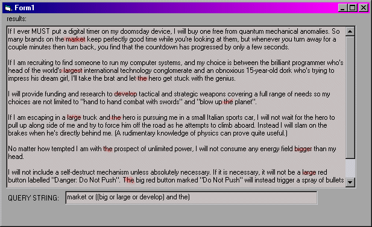



## A boolean expression parser, complete search engine like support for and, or, not, brackets, "", etc

### Description

Ever wanted the ability to run a 'smart' search, ie, with full and's, or's, not's, xor's, brackets (even nested brackets), and "". Basically like a search engine? This is the vb code to do it for you. An example expression would be:

animals and ((cats or feline) or (dogs or canine)) and "is cuddly"

Very usefull and very easy to implement
 
### More Info
 

             |
---                |---
**Submitted On**   |2002-07-21 21:02:48
**By**             |[Ashley Harris](https://github.com/Planet-Source-Code/PSCIndex/blob/master/ByAuthor/ashley-harris.md)
**Level**          |Intermediate
**User Rating**    |4.5 (45 globes from 10 users)
**Compatibility**  |VB 6\.0, VB Script, ASP \(Active Server Pages\) , VBA MS Access, VBA MS Excel
**Category**       |[String Manipulation](https://github.com/Planet-Source-Code/PSCIndex/blob/master/ByCategory/string-manipulation__1-5.md)
**World**          |[Visual Basic](https://github.com/Planet-Source-Code/PSCIndex/blob/master/ByWorld/visual-basic.md)
**Archive File**   |[A\_boolean\_125278912002\.zip](https://github.com/Planet-Source-Code/ashley-harris-a-boolean-expression-parser-complete-search-engine-like-support-for-and-or-n__1-38562/archive/master.zip)

